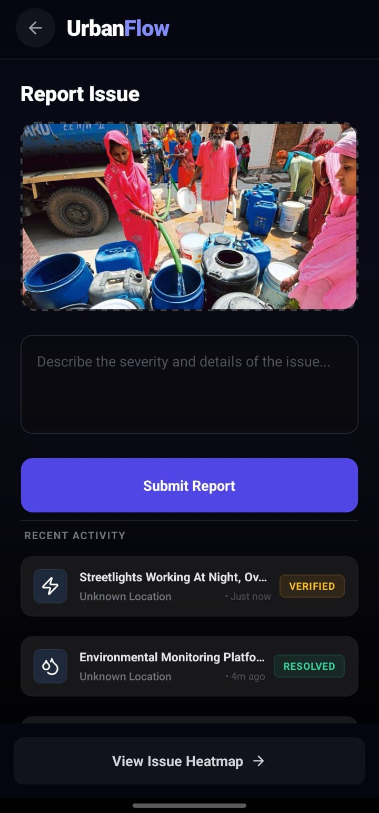
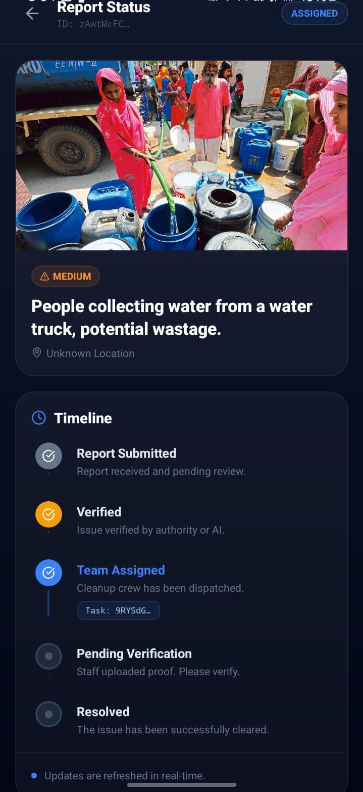
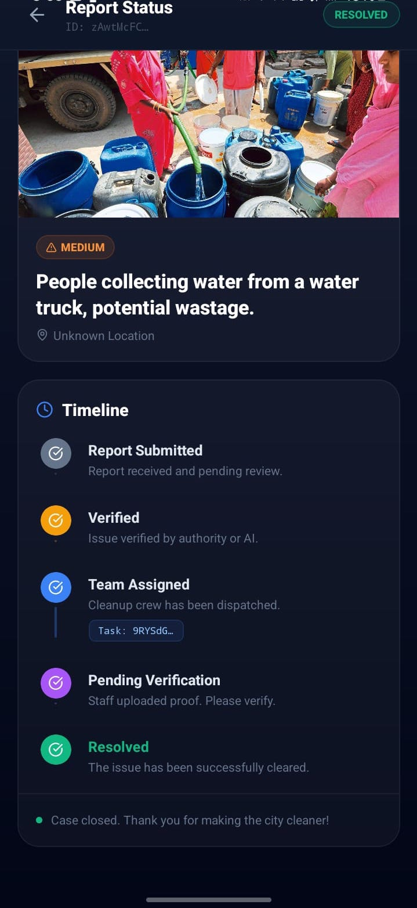
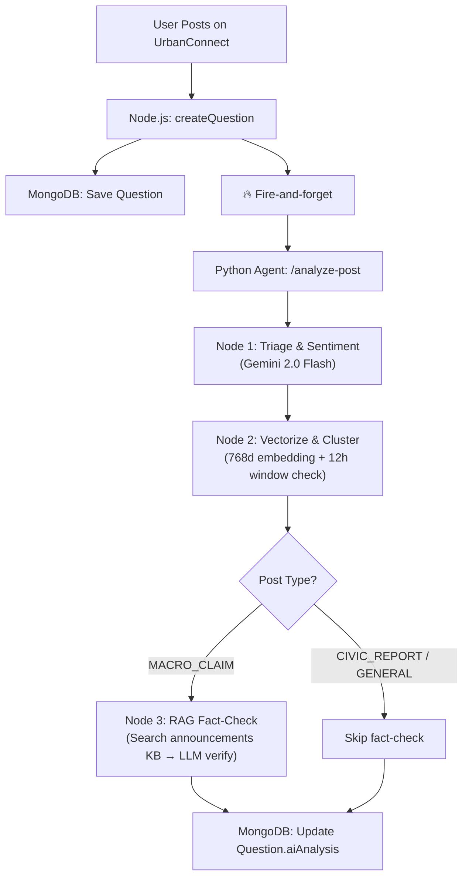
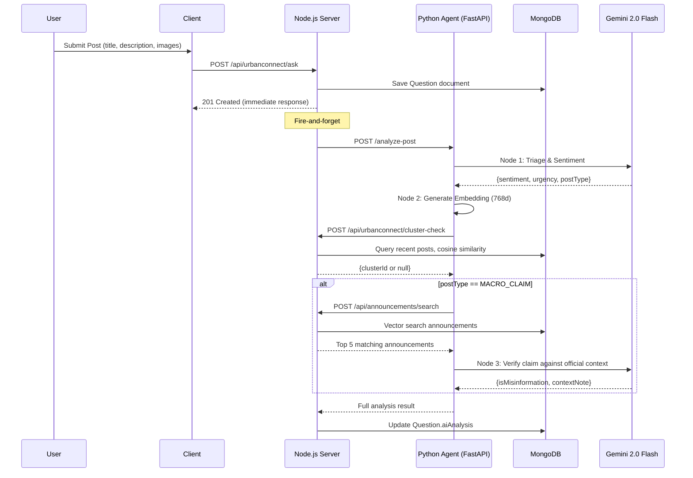

# UrbanFlow: The Integrated AI-Powered Civic Management Suite

**SANKALP Hackathon 2026**  
**Team:** Shreyansh Sachan | Ishwar | Aryan Gupta | Arushi Nayak

---

## Project Overview

UrbanFlow is a production-grade, AI-first civic operating system that transforms the relationship between citizens, municipal administration, local leaders, and field operations. Traditional urban governance suffers from fragmented communication, manual processes, reactive decision-making, and declining public trust. UrbanFlow addresses these systemic challenges by deploying a synchronized, three-tier ecosystem driven by Large Language Models (LLMs), multi-agent AI orchestration, real-time streaming, computer vision, satellite analytics, and geospatial intelligence.

Every layer of the system is designed around the principle that **AI should be the first responder** — triaging, classifying, routing, and verifying civic actions before a human ever needs to intervene.

The system is divided into three primary clients:
1. **Citizen Portal** — AI-assisted mobile application for reporting, safety, employment, and community
2. **Administrative Command Hub** — AI-driven web dashboard for municipal decision-makers and administrators
3. **Field Workforce Interface** — Mobile/web task manager for on-ground workers with AI-verified proof of work

---

## Problem Statements Addressed

### Category 1 & 2 — Urban Civic Services
Citizens lack unified, intelligent channels for reporting grievances, accessing safe navigation, finding employment, and coordinating community resources. Municipal systems operate in silos with no AI layer to triage, route, or verify work — resulting in slow response, low transparency, and poor outcomes.

### Category 3 — AI for Local Leadership, Decision Intelligence & Public Trust
Local leaders operate at the front line of service delivery, yet most grassroots governance processes remain fragmented and unstructured. Citizen sentiment, grievance data, work completion status, and scheme progress are scattered across verbal complaints, paper records, and social media. UrbanFlow's **Civic Intelligence Dashboard** directly addresses this with:

- AI-powered structuring of citizen issues from voice, text, image, and social media inputs
- Intelligent issue prioritization using ML-based urgency, impact, and recurrence scoring
- AI-validated geo-tagged, time-stamped verification of field work completion
- Natural Language Processing (NLP) pipelines for social media sentiment and misinformation detection
- AI-assisted generation of verified public communications and official announcements
- Real-time dashboards exposing execution status and citizen trust indicators to local leadership

---

## Application Walkthrough

### Citizen Mobile Application

The mobile interface is designed for accessibility and rapid response, enabling citizens to interact with AI-powered civic tools from a single unified surface.

<p align="center">
  
  
  
  
</p>
<p align="center">
  <em>Left to Right: Dashboard Home · CivicConnect AI Reporting · SisterHood Safe Navigation · StreetGig AI Job Matching</em>
</p>

---

### Web Administration Panel

The centralized command hub where municipal authorities leverage AI-generated summaries, anomaly alerts, live maps, and satellite data to orchestrate city operations.

<p align="center">
  
  
</p>
<p align="center">
  
  
</p>
<p align="center">
  <em>Top: AI-Triaged Master Dashboard and Live Complaint Heatmap · Bottom: GeoScope Satellite Intelligence and KindShare NGO Coordination Portal</em>
</p>

---

### Civic Intelligence Dashboard — AI Leadership Module

A dedicated AI decision-support surface for local leaders and administrators, surfacing ground realities from both citizen-reported data and civic social media signals.

<p align="center">
  
  
</p>
<p align="center">
  
  
</p>
<p align="center">
  <em>Top: AI Issue Prioritization Engine and Citizen Sentiment Monitor · Bottom: AI Field Work Verifier and AI Communication Generator</em>
</p>

---

### Staff and On-Ground Worker Interface

Purpose-built views for municipal workers, fire staff, and first responders. AI assigns, routes, and verifies tasks — reducing administrative overhead to near zero.

<p align="center">
  
  
</p>
<p align="center">
  <em>Left: AI-Prioritized Task Queue with live routing · Right: AI-Validated Photo Proof of Resolution</em>
</p>

---

## Detailed Feature Breakdown

### 1. SisterHood — AI-Powered Personal Safety & Emergency Response

SisterHood is a real-time safety platform built on continuous AI inference and decentralized emergency coordination, primarily targeting women navigating urban environments.

**AI Safe Route Engine**
The routing system goes entirely beyond standard shortest-path GPS algorithms. It ingests a multi-factor safety index composed of: historical incident heatmaps sourced from civic reports and police APIs, real-time crowd density derived from anonymized location clustering, street lighting intensity scores mapped from satellite imagery, and time-of-day risk modifiers. A trained ML scoring model combines these features into a per-segment safety score, which is fed into a modified Dijkstra's algorithm that optimizes for safety-weighted cost rather than pure distance. The resulting route is rendered on a risk-heatmap overlay so the user can understand why a path was chosen.

**Acoustic Distress AI Monitor**
Running entirely on-device using a lightweight TensorFlow Lite classification model, the acoustic monitor continuously processes microphone input at 16kHz via a sliding 3-second buffer. The model, trained on a labeled dataset of distress vocalizations, trigger words, and ambient soundscapes, outputs a confidence score every second. When confidence exceeds a configurable threshold for multiple consecutive frames, the system autonomously escalates to a full SOS workflow — requiring zero physical user interaction. This design is specifically intended for scenarios where manual SOS activation is impossible.

**Decentralized Emergency Response Network**
Upon SOS activation, three parallel actions are triggered simultaneously: (1) A POST to the backend API logs the incident with GPS coordinates, user identity, and a Firebase RTDB write that broadcasts to subscribed police dispatch systems. (2) A geofenced push notification broadcasts to a radius of nearby verified UrbanFlow users who opt into the community responder network, enabling immediate bystander assistance before official units arrive. (3) The SisterHood map surface activates a live tracking session, allowing trusted contacts to follow the user's location in real-time.

**Companion Route Matching**
An AI matching algorithm identifies other verified users traveling the same route within a ±10-minute departure window using vector similarity on encoded route segments. Users are matched and offered opt-in real-time coordination, creating a dynamic, organic safety network without requiring pre-registration of contacts.

---

### 2. CivicConnect (EcoSnap) — AI-Triaged Unified Grievance Reporting

CivicConnect replaces the highly siloed and manual approach to municipal complaints with a fully AI-automated pipeline covering waste management, electricity faults, water supply, road infrastructure, and fire safety.

**Multimodal AI Intake**
Citizens can file grievances using image uploads, free-text descriptions, or voice note transcription (converted to text via OpenAI Whisper). A vision-language AI model (built on Google Cloud Vertex AI) performs joint analysis on image + text, extracting: issue type classification, severity level (1–5), estimated impact area, and a plain-English description of what it detects (e.g., "Overflowing municipal dumpster with standing water visible"). This AI-generated structured record replaces the manual data entry step entirely.

**Intelligent Spam and Irrelevance Filtering**
Before any grievance touches the municipal database, it passes through a multi-stage AI filter pipeline. Stage 1: a binary image relevance classifier rejects non-civic images (selfies, generic photos). Stage 2: a duplicate detection model using perceptual hashing and NLP embedding similarity identifies reports that are near-duplicates of existing open grievances and merges them rather than creating new records. Stage 3: a quality scoring model rejects submissions where the AI confidence is below threshold, prompting the citizen to re-upload with a clear image.

**Automated Departmental Routing and Assignment**
Verified complaints are automatically routed to the correct department (sanitation, electricity, road, fire, water) using a multi-label classification model. Within each department, the system queries the spatial index of available field workers and assigns the complaint to the nearest worker whose current task queue permits. Assignment is written to the worker's Firebase RTDB task feed in real-time.

**AI Resolution Verification**
When a field worker marks a grievance resolved and uploads photographic proof, an AI verification agent performs a before/after spatial consistency check: it validates that the photo GPS coordinates match the grievance location, checks timestamp authenticity via metadata, and runs a visual similarity model to confirm that the reported issue (e.g., pothole, dumpster overflow) is no longer visible in the submitted image. Only AI-approved submissions update the grievance status — preventing false resolution.

---

### 3. GeoScope — AI-Augmented Satellite Environmental Intelligence

GeoScope is a macro-scale environmental monitoring system built on Google Earth Engine's petabyte-scale satellite data infrastructure, extended with custom AI inference pipelines.

**Atmospheric Pollution Monitoring**
GeoScope ingests Sentinel-5P satellite imagery streamed through the Google Earth Engine JavaScript and Python APIs. An AI analysis pipeline processes band-specific absorption data (SO2, NO2, CO, aerosol optical depth) and generates interpolated pollution density maps at a 1km² grid resolution. These maps are updated on a configurable cadence and overlaid on the administrative dashboard with AI-generated risk commentary explaining anomalies (e.g., a sudden NO2 spike near an industrial zone flagged as a potential regulatory violation).

**Urban Heat Island (UHI) Detection**
The system processes Landsat-8 thermal infrared band data to compute Land Surface Temperature (LST) using the Split-Window Algorithm. An AI segmentation model identifies urban heat island zones by comparing LST against the city's mean baseline and flags areas exceeding threshold differentials. These zones are cross-referenced with the city's infrastructure data to recommend targeted interventions: additional green cover, reflective roofing, or cooling infrastructure deployment.

**Flood Risk and Deforestation Change Detection**
Using multi-temporal SAR (Synthetic Aperture Radar) imagery from Sentinel-1, GeoScope runs an AI change detection model that identifies surface water expansion events (potential flooding) with high temporal precision even through cloud cover — a limitation that prevents optical-only solutions. A separate NDVI (Normalized Difference Vegetation Index) differential model detects localized deforestation events between satellite acquisition cycles.

---

### 4. StreetGig — AI-Matched Micro-Employment Exchange

StreetGig is a hyperlocal AI-powered labor marketplace that connects daily wage workers, freelancers, and gig workers with immediate community needs using intelligent matching and skill intelligence.

**AI Worker-Job Matching via Embedding Vectors**
Every worker profile is encoded into a semantic vector embedding — the "Master Profile Vector" — derived from their declared skills, job history, completed work descriptions, and AI-extracted competency signals from employer feedback. Every posted job is similarly embedded at creation time using OpenAI's embedding API. At recommendation time, the system computes cosine similarity between the worker's profile vector and all nearby open jobs, ranking results by a composite score of semantic similarity and haversine distance. This ensures that the jobs surfaced are both geographically accessible and genuinely matched to the worker's capabilities — not just keyword matches.

**Geohash-Based Proximity Indexing**
Job discovery is powered by a geohash spatial indexing system at precision level 6 (~1.2km² cells). Each job is stored with both a geohash4 (broad area) and geohash6 (precise cell) index. Discovery queries fetch all jobs within the 9-cell geohash neighborhood of the user's current location in a single Firestore query, eliminating the need for expensive radius queries. Recommendation endpoints then apply the AI similarity and filter pipeline in-memory on this pre-fetched neighbourhood set.

**AI Skill Gap Analysis and Scheme Recommendation**
After a job is closed, the employer submits structured feedback through an AI-generated feedback form (tailored per job category). An AI agent processes the ratings, feedback descriptions, and job outcomes to generate a skill gap string that identifies specific competency deficits (e.g., "Lacks knowledge of load-bearing calculations for carpentry"). These skill gap tags accumulate over a worker's history. A separate recommendation agent then matches these gaps against a database of 150+ government upskilling schemes and training programs, surfacing the most relevant ones in the StreetGig Schemes modal — categorized as Upgradation Courses (matching existing strengths) and Improvement Courses (addressing identified gaps).

**Worker Discoverability and Employer-Side AI Matching**
Employers posting jobs trigger a background AI worker discovery task. The system queries all active workers with `interestedToWork: true` matching the job's category, scores each worker's profile vector against the job embedding via cosine similarity, and returns a ranked shortlist of ideal candidates. Employers can initiate direct job-specific chat rooms with matched workers, with room metadata pre-populated with job terms for transparency.

---

### 5. KindShare — AI-Coordinated Resource Redistribution

KindShare is a hyper-local logistics intelligence system that uses AI to eliminate resource waste and accelerate the delivery of essential goods to vulnerable populations.

**AI-Assisted Donation Matching**
When a donor lists items (food, clothing, household goods), an AI classification model extracts item attributes, estimates shelf life for perishable goods, and constructs a structured inventory record. A matching agent then identifies the most suitable NGO recipient based on: geographic proximity, the NGO's declared current needs, verified capacity to handle the donation volume, and historical fulfillment reliability scores. Time-critical matches (perishable food) are weighted by urgency coefficient, ensuring hot meals and fresh produce reach NGOs within the minimum viable window.

**Automated Pickup Logistics**
Upon donor-NGO match confirmation, the system automatically generates a pickup scheduling proposal based on the donor's listed availability windows and the NGO's operational hours. A confirmation notification is dispatched to both parties via Firebase Cloud Messaging. For large-volume donations, the system identifies and coordinates a volunteer or partner logistics provider within the same geohash zone.

**Impact Analytics for Administrators**
The KindShare admin portal exposes AI-generated impact summaries: estimated meals provided, kilograms of goods redistributed, CO2 saved from food waste diversion, and NGO utilization rates. These metrics are updated in real-time as donations are confirmed and verified.

---

### 6. UrbanConnect — AI-Moderated Civic Social Layer

UrbanConnect is a structured civic discourse platform where residents discuss local issues, share information, and engage with each other — with AI moderation ensuring quality and safety.

**Threaded Discussion with AI Content Moderation and Fact-Checking**
UrbanConnect supports nested threaded comments with upvote/downvote voting (one vote per user per item, enforced via server-side user+item keyed deduplication). All submitted posts and comments pass through a multi-stage AI pipeline:
1. **Triage & Sentiment**: Determines post sentiment and identifies the post type.
2. **Vectorize & Cluster**: Generates 768d embeddings to detect similar recent posts in the MongoDB vector store.
3. **RAG Fact-Check**: For "MACRO_CLAIM" post types, verifies the claim against official civic announcements.

Flagged content or misinformation is automatically annotated or suppressed pending review rather than deleted, preserving auditability.

**AI Analytics Architecture**


**Data Flow Sequence**


**Per-User Structured Voting Integrity**
The voting system uses a server-side `Vote` model keyed on `userId + targetId + targetType`. Before recording a vote, the API checks for an existing record and either creates or toggles the vote, preventing manipulation via multiple submissions. Vote counts are aggregated in real-time and surfaced in the UI with directional trend indicators.

---

### 7. Civic Intelligence Dashboard — AI Decision Support for Local Leaders *(Category 3)*

The Civic Intelligence Dashboard is UrbanFlow's dedicated answer to Category 3 — an AI-native leadership layer that transforms fragmented civic data into structured, actionable intelligence for local administrators and elected representatives.

**Multi-Modal AI Issue Intake**
Citizens and field workers can submit civic issues via voice (transcribed using OpenAI Whisper), free text (processed via NLP pipeline), or images (analyzed by vision AI). The AI structures all submissions into a uniform schema: location, category, severity, affected population estimate, and recurrence flag. Voice submissions are particularly important for reaching citizens with low digital literacy.

**ML-Based Prioritization Engine**
Every incoming issue is scored by a multi-factor ML model trained on historical civic data. The prioritization composite score weighs: urgency (time-sensitivity of the issue type), impact radius (number of citizens potentially affected based on geospatial clustering), recurrence frequency (how many times this issue type has been reported in this zone), and resource availability (current field worker capacity). The ranked issue queue is surfaced to leaders in a real-time leaderboard view, enabling immediate, data-driven prioritization without manual triage.

**AI Field Work Verification**
When field workers mark tasks complete and submit photo evidence, a multi-step AI verification pipeline runs: (1) GPS coordinate extraction and cross-validation against the task's target location, (2) timestamp metadata authenticity verification to detect clock manipulation, (3) computer vision content validation confirming the submitted image matches the expected post-resolution state (e.g., a cleared road after pothole repair), and (4) an overall authenticity confidence score. Only submissions exceeding the confidence threshold update the leader's execution status dashboard — preventing false reporting.

**Social Media NLP Sentiment Pipeline**
A continuous background agent scrapes and analyzes public social media signals from civic-relevant platforms. An NLP pipeline applies: sentiment classification (positive/negative/neutral) at the post level, topic modeling using Latent Dirichlet Allocation (LDA) to surface emerging local issues, and a misinformation detection model that flags posts contradicting verified civic records (e.g., a rumour that a road was repaired when it remains open in the system). Leaders receive a real-time sentiment timeline per ward, with AI-generated summaries of dominant citizen concerns.

**AI Communication Generator**
Leaders can generate verified, factual public announcements in seconds. The AI drafts communications grounded in live system data: resolution counts, pending grievances, scheme progress, and sentiment trends. A tone selector allows switching between formal (official notifications), empathetic (community outreach), and informational (status updates) styles. The AI adds supporting data citations inline, ensuring all public communications are transparent and verifiable. One-click publishing sends announcements to the official channel (push notification, civic portal, or SMS gateway).

**Public Trust Index Dashboard**
An aggregate real-time trust index is computed from three data streams: grievance resolution rate (percentage of reported issues resolved within SLA), citizen sentiment score (from the NLP pipeline), and scheme implementation progress (percentage of active government programs with verified progress records). This composite index is visualized per ward and per time period, giving leaders a measurable signal of public trust that can be tracked against their decisions.

---

## Technical Architecture

UrbanFlow runs on a production-grade, fault-tolerant microservices architecture designed for high availability, real-time AI inference, and complex multi-agent orchestration at scale.

### System Architecture Overview

```
┌─────────────────────────────────────────────────────────────────┐
│                      CLIENT LAYER                               │
│  React Native Mobile App │ React.js Web Dashboard │ Staff PWA   │
└───────────────┬─────────────────────────┬───────────────────────┘
                │ HTTPS / WebSocket        │ Firebase RTDB
┌───────────────▼──────────────────────────────────────────────────┐
│                   API GATEWAY (Node.js / Express)                │
│  Auth Middleware (Auth0 JWT)  │  Rate Limiting (Redis)           │
│  REST Endpoints  │  Event Emitters  │  Webhook Receivers         │
└──────────┬─────────────────────────────┬────────────────────────┘
           │ HTTP / gRPC                  │ Message Queue (RabbitMQ)
┌──────────▼──────────────────────────────────────────────────────┐
│              AI INFERENCE ENGINE (Python / FastAPI)             │
│  Multi-Agent Orchestration (LangChain)                          │
│  ┌──────────┐ ┌──────────┐ ┌──────────┐ ┌──────────────────┐  │
│  │ Safety   │ │ Infra    │ │ Jobs     │ │ Leadership/      │  │
│  │ Agent    │ │ Agent    │ │ Agent    │ │ Sentiment Agent  │  │
│  └──────────┘ └──────────┘ └──────────┘ └──────────────────┘  │
│  Vision AI │ NLP Pipeline │ Embeddings │ Whisper Transcription  │
└──────────┬──────────────────────────────────────────────────────┘
           │
┌──────────▼──────────────────────────────────────────────────────┐
│                      DATA LAYER                                 │
│  MongoDB (primary)  │  Firebase RTDB (real-time)  │ Redis       │
│  Firestore (spatial)│  Cloudinary (media)         │ (cache)     │
└─────────────────────────────────────────────────────────────────┘
```

### Core Technology Stack

| Layer | Technologies | Purpose |
|---|---|---|
| **Citizen Mobile App** | React Native, Expo, NativeWind | Cross-platform mobile with background task execution and GPS |
| **Web Dashboard** | React.js (Vite), Tailwind CSS, Leaflet, Google Maps | Responsive, data-dense administrative interface |
| **Primary API Gateway** | Node.js, Express.js | REST routing, auth, business logic, event emission |
| **AI Inference Engine** | Python, FastAPI | ML model serving, multi-agent orchestration, vision processing |
| **Primary Database** | MongoDB | Complex nested documents: grievances, profiles, analytics |
| **Real-time Layer** | Firebase Realtime Database (RTDB) | Sub-100ms SOS signals, live staff tracking, chat |
| **Spatial Database** | Firestore | Geohash-indexed job and alert records for proximity queries |
| **Cache Layer** | Redis | Spatial query caching, API rate limiting, session store |
| **AI Orchestration** | LangChain (Python) | Multi-agent networks, tool-use pipelines, chain-of-thought flows |
| **LLM & Vision** | Google Cloud Vertex AI, OpenAI GPT-4o | Complaint analysis, skill gap inference, NL generation |
| **Embeddings** | OpenAI `text-embedding-3-large` | Worker profile and job description vector encoding |
| **Speech-to-Text** | OpenAI Whisper | Voice grievance transcription |
| **Satellite Data** | Google Earth Engine (GEE) | Environmental monitoring, thermal analysis, SAR flood detection |
| **Geospatial** | Google Maps Platform, ngeohash | Routing, geocoding, proximity indexing |
| **Media Storage** | Cloudinary | Complaint images, profile photos, resolution proof upload |
| **Auth** | Auth0 (JWT), Firebase Auth | Multi-platform authentication and session management |
| **Push Notifications** | Firebase Cloud Messaging | Dispatch alerts, SOS broadcasts, status updates |
| **Async Messaging** | RabbitMQ | Async task queues, background AI processing, notification dispatch |

---

### AI Pipeline Deep-Dives

#### Multi-Agent Orchestration (LangChain)
UrbanFlow uses LangChain to construct a network of specialized AI agents, each with access to domain-specific tools (database lookups, API calls, embedding computations). Agents are invoked via a routing chain that classifies incoming requests by domain and dispatches to the appropriate agent. Agents use ReAct (Reasoning + Acting) prompting patterns, enabling them to iteratively query tools, reason over intermediate outputs, and arrive at grounded decisions rather than hallucinated responses.

#### Vector Embedding Architecture
All semantic matching in UrbanFlow — job-worker matching, scheme-worker matching, and complaint deduplication — is powered by `text-embedding-3-large` embeddings stored as Firestore Vector fields. Similarity is computed server-side using cosine similarity in Python (NumPy), avoiding the need for a dedicated vector database at this scale while maintaining sub-200ms inference times.

#### Geohash Spatial Indexing
All location-dependent queries (nearby jobs, nearby grievances, proximity-based alerts) use ngeohash precision-4 (≈39km²) for broad neighborhood lookup and precision-6 (≈1.2km²) for precise proximity. This allows single-query retrieval of all records within a target area using Firestore's `IN` operator over the 9-cell geohash neighborhood, achieving O(1) spatial lookup complexity without geospatial indexes.

#### Real-Time Firebase Architecture
SOS events, task assignments, worker location pings, and chat messages are all managed through Firebase Realtime Database with structured path schemas:
- `fireAlerts/{geohash}/{alertId}` — geo-indexed SOS records
- `staff/fire/{geohash}/{truckId}/coords` — live truck GPS coordinates
- `jobs/rooms/{chatRoomId}/members/{userId}` — per-room participant tracking
- `userActiveAlerts/{userId}` — per-user active alert state for notification deduplication

All RTDB listeners are attached at the component level and cleaned up on unmount, preventing memory leaks in long-running mobile sessions.

---

*UrbanFlow — Every citizen action intelligently processed. Every civic decision AI-informed. Built for the city of tomorrow.*
